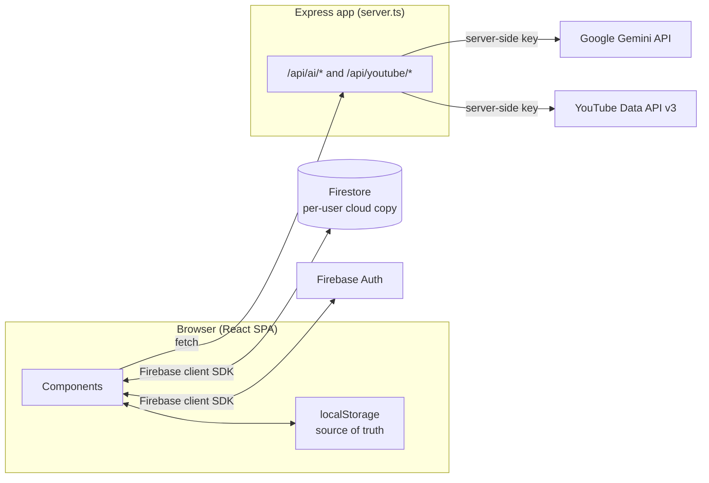
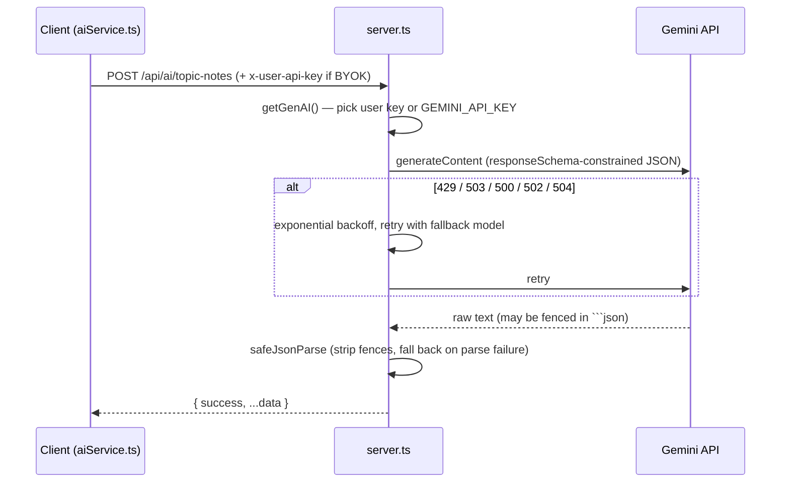

# Architecture

This document explains how AI Note Maker is put together, and *why* — for setup steps, see [DEVELOPMENT.md](DEVELOPMENT.md); for endpoint-level detail, see [API.md](API.md).

## System overview

Two things to notice: **AI and YouTube calls are always proxied through the Express server** (the client never talks to Gemini or YouTube directly), while **Auth and Firestore are talked to directly from the client** via the Firebase SDK, with access control enforced by `firestore.rules` rather than by a backend layer.

## Core decisions, and why

**1. Local-first storage, cloud sync is additive.**
Every domain object (`NoteDocument`, `Collection`, `FlashcardDeck`, `TestAttempt`, etc.) is read from and written to `localStorage` first (`src/lib/storage.ts`). The app is fully functional signed out. When a user is authenticated, writes additionally fan out to Firestore (`src/lib/syncService.ts`), and on auth-state change `syncAllCloudDataToLocal` pulls the user's cloud data down and merges it into local storage. This keeps the product usable with zero setup and makes cloud sync a pure enhancement rather than a requirement.

**2. AI calls never happen client-side.**
All Gemini access lives in `server.ts` behind `/api/ai/*` routes. The client-side `src/lib/aiService.ts` and `src/lib/learningService.ts` are thin `fetch` wrappers — they never import `@google/genai` or hold an API key. This keeps the app's default API key server-only, while still supporting **BYOK (bring your own key)**: if a user sets a personal key in Settings, it's sent as the `x-user-api-key` header and `getGenAI()` in `server.ts` prefers it over the server's own `GEMINI_API_KEY`.

**3. No routing library — a manual view-router in `App.tsx`.**
Navigation is a single `activeView` string union (~20 view names) held in `App.tsx` state, with cross-cutting state (active note, active test, active learning session) co-located in the same component and passed down as props/callbacks. There's no React Router. This is a deliberate simplicity choice for an app of this size — see [DEVELOPMENT.md](DEVELOPMENT.md#adding-a-new-view) for how to add a view within this pattern.

**4. One domain model file.**
`src/types.ts` is the single source of truth for every entity in the system — notes, tests, flashcards, community resources, Shorts Learning trees, everything. There are no per-feature type files. This avoids type drift between features that share concepts (e.g. a `NoteDocument` referenced from `SavedTest`, `TopicHubResource`, and `CommunityNote` all mean the same thing).

**5. Content sources are pluggable via a provider registry.**
`src/lib/providers/ContentProvider.ts` defines a `ContentProvider` interface and a registry that feature code resolves providers from by name (`providerRegistry.get("youtube")`). Only `YouTubeProvider` is registered today, but `LearningContentProvider` in `types.ts` already includes `'instagram' | 'pinterest' | 'other'` — the registry exists so those can be added later without touching `learningService.ts` call sites.

**6. Firestore's data-shape gaps are papered over at the sync boundary.**
Firestore rejects nested arrays and `undefined` field values. `sanitizeForFirestore` (in `syncService.ts`) strips `undefined` recursively and wraps nested arrays (e.g. a note block's `tableData: string[][]`) as `{ _row: [...] }` before every write; `deserializeFromFirestore` reverses it on read. Any new field containing a 2D array or optional value must go through these helpers.

## Module map

| Path | Responsibility |
|---|---|
| `server.ts` | Express app: all `/api/ai/*` and `/api/youtube/*` routes, Gemini client setup, dev-mode Vite middleware, prod static file serving |
| `api/index.ts` | Vercel serverless entry point — re-exports the same Express `app` for the `/api/*` rewrite in `vercel.json` |
| `src/App.tsx` | View-router + cross-cutting app state |
| `src/components/` | One folder per feature module (`Assessment/`, `Flashcards/`, `ShortsLearning/`, `Community/`, `Collections/`, `Auth/`, `AudioPlayer/`, `NoteStudio/`, `Settings/`) plus top-level views (`HomeView`, `NotesListView`, `RoadmapEditor`, `GenerationProgress`, `Header`) |
| `src/lib/storage.ts` | Local (`localStorage`) CRUD for every entity, plus local↔cloud migration and sync orchestration |
| `src/lib/syncService.ts` | Firestore CRUD (one function pair per entity), Firestore data-shape sanitization |
| `src/lib/aiService.ts` | Client wrappers for note/roadmap/test/flashcard/podcast AI endpoints |
| `src/lib/learningService.ts` | Learning-tree generation/flattening and per-node video search orchestration for Shorts Learning |
| `src/lib/providers/` | `ContentProvider` interface, registry, and `YouTubeProvider` implementation |
| `src/lib/firebase.ts` | Firebase app/auth/Firestore client initialization |
| `src/lib/AuthContext.tsx` | React context wrapping Firebase Auth (email, Google, anonymous) |
| `src/types.ts` | Every domain type in the app |
| `firestore.rules` | Per-collection ownership rules (source of truth for who can read/write what) |

## Data flow: writes and sync

1. **Write:** a feature calls e.g. `saveNote(note)` in `storage.ts`. This writes to `localStorage` immediately, then — if a user is signed in — fires `saveNoteToCloud(note, uid)` in the background. The UI never waits on the cloud write.
2. **Sign-in:** `AuthContext` fires `syncAllCloudDataToLocal(uid)`, which fetches every entity type in parallel from Firestore and overwrites the corresponding `localStorage` key *if the cloud has any data for it* (empty cloud collections don't wipe local data).
3. **First sign-in with pre-existing local data:** `App.tsx` detects local data that predates a per-user "already migrated" flag and opens the migration modal, which calls `migrateLocalDataToCloud(uid)` — uploading everything local up to Firestore, tracking per-item success/failure (a Firestore write can fail silently per-document, e.g. exceeding the 1MB document size limit) rather than assuming success from the absence of a thrown error.

## Firestore data model

Each top-level Firestore collection maps 1:1 to a domain entity. Ownership is enforced in `firestore.rules`, not in application code:

| Collection | Ownership field | Public read? |
|---|---|---|
| `users` | doc ID == uid | No |
| `notes`, `collections`, `decks`, `flashcards`, `tests`, `attempts` | `ownerId` / `authorId` | No |
| `user_settings` | doc ID == uid | No |
| `community_notes`, `community_topic_hubs` | `authorId` / `creatorId` | **Yes** (read-only to everyone; write requires ownership) |
| `saved_topic_hubs` | `userId` | No |
| `reports` | `reporterId` | No (own reports only) |
| `learning_trees`, `learning_sessions`, `saved_learning_resources` | `userId` | No |
| `teachback_evaluations`, `revision_resources` | `ownerId` | No |
| `podcasts` | `ownerId` | No |

## AI request lifecycle

Every AI endpoint follows this same shape: a `responseSchema` constrains Gemini's output to structured JSON, `generateWithRetry` retries transient failures with a model fallback chain (`gemini-3.6-flash` → `gemini-2.5-flash` → `gemini-1.5-flash`), and `safeJsonParse` defensively parses the result since models occasionally wrap JSON in markdown fences despite `responseMimeType: "application/json"`. See [API.md](API.md) for the full endpoint list.

## Deployment topologies

Two deployment paths are wired up in this repo:

- **Google AI Studio / Cloud Run** — the project was scaffolded via AI Studio (`metadata.json`, `assets/.aistudio/`), which injects secrets at runtime and runs `npm run build && node dist/server.cjs` as a single long-running Node process serving both the API and the built SPA.
- **Vercel** — `vercel.json` rewrites `/api/*` to the serverless function `api/index.ts`, which re-exports the same Express `app`; `npm run vercel-build` only runs `vite build` since Vercel builds the API function separately.

See [DEVELOPMENT.md](DEVELOPMENT.md#deployment) for the environment variables each path needs.
